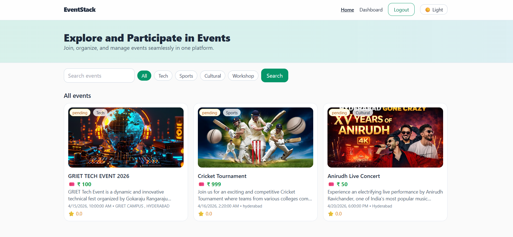
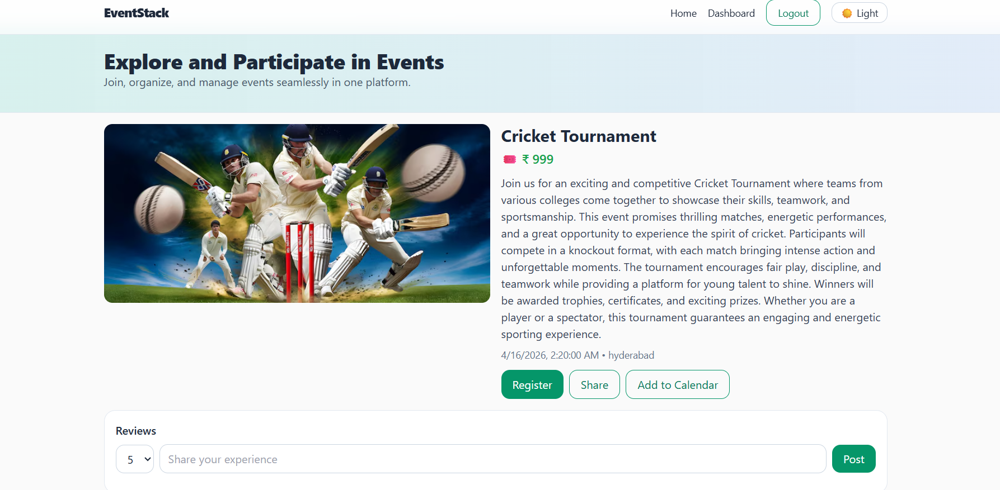
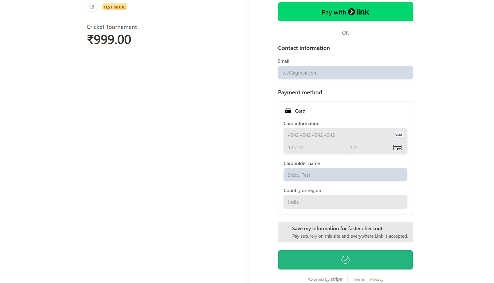
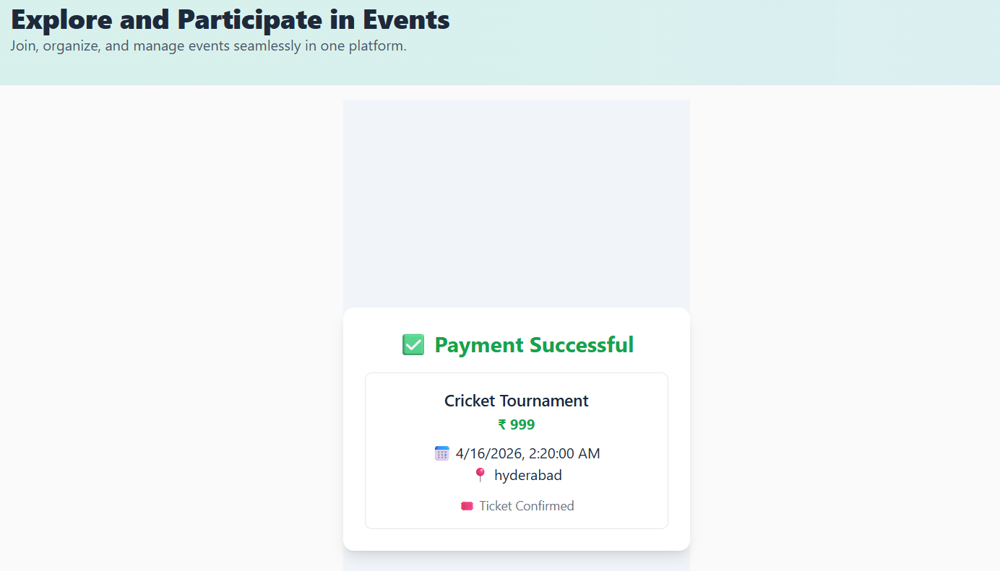
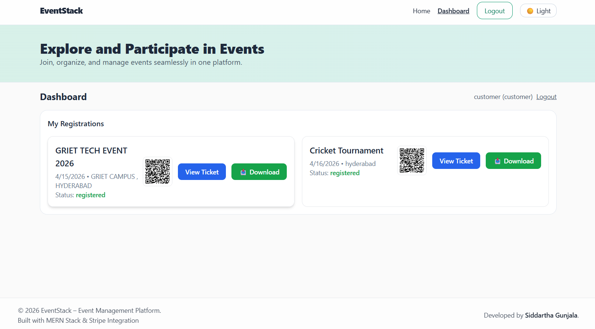

# 🚀 EventStack – An Event Management Platform

EventStack is a modern full-stack web application that simplifies event discovery, booking, and management. Users can explore events, register securely, and receive tickets, while organizers can efficiently manage events.

---

## 🌍 Overview

EventStack provides:
- Event discovery across categories  
- Secure user authentication  
- Ticket booking system  
- Organizer dashboard for event management  

---

## ✨ Features

### 👤 User Features
- Browse events (Tech, Sports, Cultural, Workshops)
- View event details
- Register for events
- Secure payment (Stripe)
- Ticket generation
- View bookings

### 🧑‍💼 Organizer Features
- Create and manage events
- Upload event posters
- Track participants
- Export participant data

### 🔐 Authentication
- JWT-based authentication
- Role-based access control

---

## 🛠 Tech Stack

### Frontend
- React.js (Vite)
- Tailwind CSS
- Axios

### Backend
- Node.js
- Express.js

### Database
- MongoDB Atlas

### Payment
- Stripe API

---

## 🏗 System Architecture

```
Frontend (React + Vite)
        ↓
API Requests (Axios)
        ↓
Backend (Node.js + Express)
        ↓
MongoDB Database
        ↓
Stripe Payment Gateway
```

---

## ⚙️ Setup Instructions

### 📌 Prerequisites

- Node.js (v18+)
- npm (v9+)
- MongoDB Atlas account
- Stripe account (optional)

---

### 🔧 1. Clone Repository

```bash
git clone https://github.com/your-username/eventstack.git
cd eventstack
```

---

### 🔧 2. Backend Setup

```bash
cd backend
npm install
```

#### Create `.env` file in backend:

```env
MONGO_URI=your_mongodb_connection_string
JWT_SECRET=your_secret_key
PORT=5050
CLIENT_URL=http://localhost:5173
STRIPE_SECRET_KEY=your_stripe_secret_key
```

#### Run backend:

```bash
npm run dev
```

---

### 🔧 3. Frontend Setup

```bash
cd frontend
npm install
npm run dev
```

---

## 🌐 Application URLs

Frontend: http://localhost:5173  
Backend: http://localhost:5050  

---

## 🔐 Environment Variables

| Variable           | Description                   |
|-------------------|-----------------------------|
| MONGO_URI         | MongoDB connection string   |
| JWT_SECRET        | Authentication secret       |
| STRIPE_SECRET_KEY | Stripe API key              |
| CLIENT_URL        | Frontend URL                |

---

## 📂 Environment Setup (Important)

❌ Do NOT upload `.env` to GitHub  

✅ Create `.env.example`:

```env
MONGO_URI=your_mongo_uri
JWT_SECRET=your_secret
PORT=5050
CLIENT_URL=http://localhost:5173
STRIPE_SECRET_KEY=your_stripe_key
```

Add to `.gitignore`:

```
.env
node_modules
```

---

## 🔗 API Endpoints

### Authentication
- POST `/api/auth/login`
- POST `/api/auth/signup`

### Events
- GET `/api/events`
- POST `/api/events`

### Registrations
- POST `/api/registrations/:id/register`
- GET `/api/registrations/me`

### Payment
- POST `/api/payment/checkout`

---

## 📸 Screenshots

### 🏠 Home Page


### 📄 Event Details


### 💳 Payment Page


### 🎟 Ticket Page


### 📊 Dashboard


---

## 🔄 Project Workflow

1. User signs up / logs in  
2. Browses events  
3. Selects event  
4. Registers & pays  
5. Ticket generated  
6. Data stored in database  
7. Dashboard shows bookings  

---

## 🔮 Future Enhancements

- QR code ticket validation  
- PDF ticket download  
- Email notifications  
- Admin analytics dashboard  
- Real-time updates  

---

## 👨‍💻 Author

**Gunjala Siddartha**  
B.Tech CSE (AI & ML)

---

## 📌 Conclusion

EventStack demonstrates real-world MERN stack development including authentication, booking systems, and scalable architecture.
